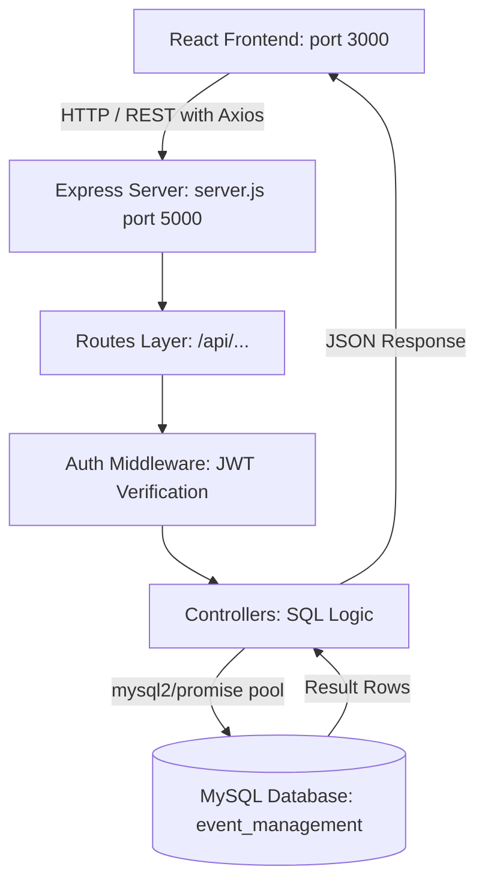

# Implementation Plan: Event Management System Backend (Node.js + Express + MySQL)

## Goal Description
Build a clean, student-friendly **Node.js + Express + MySQL REST API backend** for the Event Management System. The architecture strictly follows an entry-level college mini-project pattern where every route, SQL query, controller, and workflow is simple, readable, and easy to explain during a college project viva or demonstration.

---

## User Review Required
> [!IMPORTANT]
> - **Database Choice**: Uses raw SQL queries with `mysql2/promise` connection pool rather than complex ORMs (Prisma, Sequelize, TypeORM), ensuring complete transparency and beginner-friendly SQL code for college evaluation.
> - **Authentication**: Uses `bcryptjs` for password hashing and standard `jsonwebtoken` (JWT) for session verification.
> - **Ready-to-Import Database**: A comprehensive `database.sql` file will be provided with table definitions and realistic sample data (users, categories, events, registrations, notifications) ready for phpMyAdmin/MySQL Workbench.

---

## Architecture & Workflow



---

## Proposed Project Structure

```text
backend/
├── server.js                    # Express app setup, CORS, JSON parser, route mounting
├── package.json                 # Dependencies & dev scripts
├── .env                         # Local environment variables
├── .env.example                 # Template for database host, port, user, password, JWT secret
├── database.sql                 # Complete database schema + seed data
│
├── config/
│   └── database.js              # MySQL connection pool configuration
│
├── routes/
│   ├── authRoutes.js            # POST /register, POST /login
│   ├── userRoutes.js            # GET /profile, PUT /profile
│   ├── eventRoutes.js           # GET /, GET /:id, POST /, PUT /:id, DELETE /:id, POST /:id/register
│   ├── categoryRoutes.js        # GET /, POST /, PUT /:id, DELETE /:id
│   ├── registrationRoutes.js    # GET /my, PUT /:id/cancel
│   ├── notificationRoutes.js    # GET /, PUT /:id/read, PUT /read-all
│   └── adminRoutes.js           # GET /dashboard, GET /users, GET /events, GET /registrations
│
├── controllers/
│   ├── authController.js        # Register & Login logic with bcrypt & JWT
│   ├── userController.js        # Profile viewing & updating
│   ├── eventController.js       # Search, filter, CRUD, and event registration
│   ├── categoryController.js    # Category management
│   ├── registrationController.js# User registrations list & cancelation
│   ├── notificationController.js# Notification feeds & read status
│   └── adminController.js       # Admin metrics & management lists
│
├── middleware/
│   └── authMiddleware.js        # JWT token verification & role authorization (admin/organizer)
│
└── utils/
    └── validation.js            # Simple input validation helpers (email, required fields)
```

---

## Detailed Component Specifications

### 1. Database Schema (`database.sql`)
1. **`users` table**:
   - `id INT AUTO_INCREMENT PRIMARY KEY`
   - `name VARCHAR(100) NOT NULL`
   - `email VARCHAR(100) NOT NULL UNIQUE`
   - `phone VARCHAR(20)`
   - `password VARCHAR(255) NOT NULL`
   - `address TEXT`
   - `role ENUM('user', 'organizer', 'admin') DEFAULT 'user'`
   - `profile_image VARCHAR(255)`
   - `created_at TIMESTAMP DEFAULT CURRENT_TIMESTAMP`
   - `updated_at TIMESTAMP DEFAULT CURRENT_TIMESTAMP ON UPDATE CURRENT_TIMESTAMP`
2. **`categories` table**:
   - `id INT AUTO_INCREMENT PRIMARY KEY`
   - `name VARCHAR(100) NOT NULL UNIQUE`
   - `description TEXT`
   - `created_at TIMESTAMP DEFAULT CURRENT_TIMESTAMP`
3. **`events` table**:
   - `id INT AUTO_INCREMENT PRIMARY KEY`
   - `title VARCHAR(200) NOT NULL`
   - `description TEXT`
   - `category_id INT NOT NULL, FOREIGN KEY (category_id) REFERENCES categories(id)`
   - `date VARCHAR(50) NOT NULL`
   - `time VARCHAR(50) NOT NULL`
   - `location VARCHAR(200) NOT NULL`
   - `image VARCHAR(255)`
   - `organizer_id INT NOT NULL, FOREIGN KEY (organizer_id) REFERENCES users(id)`
   - `registration_fee DECIMAL(10,2) DEFAULT 0.00`
   - `max_participants INT DEFAULT 100`
   - `status ENUM('Published', 'Draft') DEFAULT 'Published'`
   - `created_at TIMESTAMP DEFAULT CURRENT_TIMESTAMP`
   - `updated_at TIMESTAMP DEFAULT CURRENT_TIMESTAMP ON UPDATE CURRENT_TIMESTAMP`
4. **`registrations` table**:
   - `id INT AUTO_INCREMENT PRIMARY KEY`
   - `user_id INT NOT NULL, FOREIGN KEY (user_id) REFERENCES users(id)`
   - `event_id INT NOT NULL, FOREIGN KEY (event_id) REFERENCES events(id) ON DELETE CASCADE`
   - `registration_date TIMESTAMP DEFAULT CURRENT_TIMESTAMP`
   - `status ENUM('Confirmed', 'Pending', 'Cancelled') DEFAULT 'Confirmed'`
   - `UNIQUE KEY unique_user_event (user_id, event_id)`
5. **`notifications` table**:
   - `id INT AUTO_INCREMENT PRIMARY KEY`
   - `user_id INT NOT NULL, FOREIGN KEY (user_id) REFERENCES users(id) ON DELETE CASCADE`
   - `title VARCHAR(150) NOT NULL`
   - `message TEXT NOT NULL`
   - `type ENUM('info', 'success', 'warning', 'error') DEFAULT 'info'`
   - `is_read BOOLEAN DEFAULT FALSE`
   - `created_at TIMESTAMP DEFAULT CURRENT_TIMESTAMP`

---

### 2. Standard API Response Structure
Consistent and Axios-friendly format across all endpoints:
```json
{
  "success": true,
  "message": "Operation completed successfully",
  "data": { ... }
}
```
Errors return:
```json
{
  "success": false,
  "message": "Descriptive error message"
}
```

---

### 3. REST API Endpoint Mapping

| Method | Endpoint | Protection | Description |
|--------|----------|------------|-------------|
| **POST** | `/api/auth/register` | Public | Register new user with hashed password |
| **POST** | `/api/auth/login` | Public | Login with email & password, returns JWT token |
| **GET** | `/api/users/profile` | Logged In | Fetch current user profile details |
| **PUT** | `/api/users/profile` | Logged In | Update user name, phone, address, profile image |
| **GET** | `/api/categories` | Public | Get all event categories |
| **POST** | `/api/categories` | Admin | Create a new category |
| **PUT** | `/api/categories/:id` | Admin | Update an existing category |
| **DELETE**| `/api/categories/:id` | Admin | Delete category |
| **GET** | `/api/events` | Public | List events with `?search=` and `?category=` queries |
| **GET** | `/api/events/:id` | Public | Fetch event details with category & organizer info |
| **POST** | `/api/events` | Organizer / Admin | Create new event (auto-sets organizer_id) |
| **PUT** | `/api/events/:id` | Organizer / Admin | Update event details |
| **DELETE**| `/api/events/:id` | Organizer / Admin | Delete event |
| **POST** | `/api/events/:id/register` | Logged In | Register attendee, creates notification |
| **GET** | `/api/registrations/my` | Logged In | List registrations of logged-in user |
| **PUT** | `/api/registrations/:id/cancel`| Logged In | Cancel booking (sets status to 'Cancelled') |
| **GET** | `/api/notifications` | Logged In | Get notifications for logged-in user |
| **PUT** | `/api/notifications/:id/read` | Logged In | Mark single notification as read |
| **PUT** | `/api/notifications/read-all` | Logged In | Mark all user notifications as read |
| **GET** | `/api/admin/dashboard` | Admin | Get metrics (totalUsers, totalEvents, registrations) |
| **GET** | `/api/admin/users` | Admin | List all registered users |
| **GET** | `/api/admin/events` | Admin | List all events with details |
| **GET** | `/api/admin/registrations` | Admin | List all user bookings across the platform |

---

## Verification Plan

### Automated / Command-line Verification
1. **Dependencies Installation**:
   ```bash
   cd backend && npm install
   ```
2. **Syntax & Startup Check**:
   Test server startup without database crash using graceful connection test:
   ```bash
   node -e "require('./server.js')"
   ```
3. **Route & Endpoint Verification**:
   Run endpoint ping tests on `http://localhost:5000/api` to verify CORS headers and 404/health handlers.
4. **SQL Schema Verification**:
   Inspect `database.sql` syntax and relational constraints.

### Manual Verification
1. Import `database.sql` into MySQL / phpMyAdmin.
2. Start server with `npm start` or `npm run dev`.
3. Verify signup and login returning JWT token.
4. Verify event search, event creation, and event registration.
